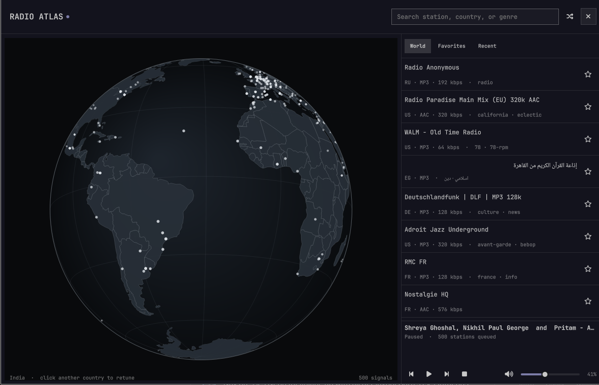

# Radio Atlas

**Radio Atlas won the [first-ever Omarchy plugin competition](https://omarchy.org/news/2026/08/the-first-plugin-competition-winners/).**
See [DHH’s announcement on X](https://x.com/dhh/status/2093443941236388051).
It’s also featured on the [official Omarchy website](https://omarchy.org/).

Explore live radio on a rotatable globe from the Omarchy bar. Click a station
signal to play it, or click a country to browse its stations. Playback runs in
`mpv`, with a dedicated MPRIS bridge so `omarchy.media` provides the usual play,
pause, previous, and next controls.

[View Radio Atlas on the Omarchy Plugin Marketplace](https://omarchyplugins.com/plugin.html?id=akshar.radio-atlas)



## Features

- Kinetic drag rotation that highlights a nearby station when it settles, plus deep wheel and button zoom on a theme-aware globe
- A fast cached world view that progressively adds thousands of stations and keeps the session catalog when closed
- Country stations stay on the session globe and take priority over background signals
- Country-level map estimates when a station has no published coordinates
- Automatic country focus for the station that is actually playing
- Current station identity, track metadata, and one-click favoriting in the player
- Instant cached results while full-directory search and country browsing refresh from Radio Browser
- Random tuning that avoids recent stations, plus favorites and listening history
- Independent volume slider, mute, and bar-wheel volume control
- Audio output picker that routes radio to any PipeWire sink, including AirPlay speakers exposed as RAOP sinks
- Centered, floating window with normal Omarchy window-manager behavior
- Automatic dismissal when Omarchy starts its screensaver
- Keyboard navigation
- Persistent world and country caches with background refresh and transient retries
- Keeps your chosen station selected if its stream fails, with explicit retry or next controls

## Install

```bash
omarchy plugin add https://github.com/AksharP5/omarchy-radio-atlas.git --enable
```

Radio Atlas uses `bubblewrap`, `curl`, `iproute2`, `jq`, `mpv`, `python`,
`python-dbus`, `python-gobject`, `socat`, `coreutils`, and `util-linux`. These
packages ship with Omarchy, including `python-dbus` through `uwsm`. Radio Atlas
provides its own MPRIS controls and disables automatic mpv script loading for
this player instance.

## Remove

Stop the independent radio player before removing the plugin:

```bash
~/.config/omarchy/plugins/akshar.radio-atlas/radio-player stop
omarchy plugin remove akshar.radio-atlas
```

Favorites, listening history, volume, and the selected audio output remain in
`~/.local/share/radio-atlas/state.json` so reinstalling restores them. Remove
`~/.local/share/radio-atlas/` manually if you also want to delete that data.

## Controls

| Input | Action |
| --- | --- |
| Drag or flick globe | Rotate; a flick coasts and highlights a nearby station |
| Wheel over globe | Zoom |
| Globe + / − buttons | Zoom |
| Click signal | Play station |
| Click country | Browse country |
| `/` | Focus search |
| Up / Down | Move through stations |
| Enter | Play selected station |
| Space | Play or pause |
| `R` | Tune a random station |
| `F` | Favorite selected station |
| `+` / `-` | Raise or lower radio volume |
| `M` | Mute or unmute |
| Speaker icon | Choose the audio output |
| Tab / Shift+Tab, then Enter or Space | Navigate and activate controls, including World / Favorites / Recent |
| `?` | Show or hide controls |
| Escape | Hide controls, clear search, or close |

On the bar, left click opens Radio Atlas, middle click tunes randomly, right
click stops its player or resumes the most recently played station when stopped,
and the mouse wheel adjusts radio volume. Volume changes through system media
controls are saved for the next player session too. If there is no listening history,
right click does nothing.

Stop also cancels pending random tuning, including before playback starts.

Search accepts country names, two-letter country codes, and aliases such as
`USA` and `UK`. Recognized countries match by code while station-name and tag
searches still run. Other queries retain country-name substring matching.
The bundled country lookup also works in the instant local preview.
If any directory search request fails, cached matches remain visible with a
service-unavailable warning.

If a station disconnects or cannot be played, Radio Atlas keeps it selected and
shows the failure. Click the play button to retry that station, or Next/Previous
to choose another queued station. It does not automatically reconnect or switch
stations. A repeated opening clip can come from the station's stream server;
retrying may play that same clip again. Radio Browser supplies station listings,
not the audio streams.

For M3U and PLS station playlists, Radio Atlas plays the first stream and keeps
Next/Previous moving between stations. Empty playlists show a playback failure
without switching stations.

Fresh world and country caches load without DNS lookups.
Country browsing picks up completed background refreshes in the open list,
preserving the selected station and ignoring updates for other countries.
The globe skips off-screen station markers when zoomed in, and player-status
updates for the same station preserve the landing highlight without repainting
the globe.
Search, world, favorites, and recent-list refreshes preserve your selected station
when it remains in the results, including its keyboard highlight. Track-title,
volume, and pause updates preserve your station-list selection.
Theme colors update the globe immediately. Background station expansion stops
after three consecutive attempts add no stations, including failed requests;
reopening Radio Atlas allows expansion to try again.

## Audio outputs and AirPlay

The speaker button next to the volume slider chooses where radio plays. It lists
every PipeWire output device through `pactl`, which ships with Omarchy's
PipeWire setup. "System default" follows the desktop's current output, the
choice is saved alongside the volume in `~/.local/share/radio-atlas/state.json`,
and switching while playing takes effect immediately. When a selected output
disappears during playback, WirePlumber may pause the player through MPRIS.
Radio Atlas distinguishes that automatic pause from a deliberate media-control
pause and resumes once when the same selected output returns. Playback already
paused before removal stays paused. A manual Pause, including another Pause while
already paused, cancels recovery. Unrelated outputs do not trigger it. Changing
stations or outputs, a stream failure, and Stop also cancel recovery. "System
default" does not identify the actual output, so it requires manual resume after
a device-loss pause.

External media-control Stop shows "Stopped" in Radio Atlas and clears the bar's
playing indicator. It also cancels pending tuning and saved-station playback
preparation, including when already stopped or a panel Stop is still completing.
New playback requests after Stop still work. Play or bar right-click resumes the
stopped station while keeping its queue. Next/Previous plays its neighboring
station, including after stopping paused playback.

AirPlay speakers appear in this list once PipeWire exposes them as RAOP sinks.
On Arch Linux, the RAOP modules ship in the optional `pipewire-zeroconf`
package. Install it, enable discovery, and restart the user services:

```bash
sudo pacman -S pipewire-zeroconf
mkdir -p ~/.config/pipewire/pipewire.conf.d
cp /usr/share/pipewire/pipewire.conf.avail/50-raop.conf \
  ~/.config/pipewire/pipewire.conf.d/
systemctl --user restart pipewire wireplumber
```

If you run a firewall such as ufw, allow the timing feedback AirPlay speakers
send back to the sender on UDP ports 6001-6002; without it the session connects
but the speaker stays silent:

```bash
sudo ufw allow in from 192.168.0.0/16 to any port 6001:6002 proto udp
```

PipeWire's RAOP discovery occasionally drops a sink when a device briefly
stops announcing itself over mDNS. If an AirPlay speaker disappears from the
output list, re-discover it with `systemctl --user restart pipewire wireplumber`.

PipeWire's RAOP sink streams classic AirPlay audio as uncompressed PCM.
AirPort Express, Apple TV, many AV receivers, and HomePods accept it; AirPlay 2
only features such as HomePod stereo pairs are not supported. A device that
refuses the stream simply stays silent; pick another output to recover.

## Data and privacy

Station data comes from the community-run
[Radio Browser](https://www.radio-browser.info/). Radio Atlas sends its name
and version as the HTTP user agent. Starting a station calls Radio Browser's
click-count endpoint. Favorites and history stay in
`~/.local/share/radio-atlas/state.json`.

Station metadata and stream URLs are community supplied. Labels are rendered
as plain text. Playback runs in an isolated network namespace and reaches
stations through a bounded proxy that rejects private and effectively local
destinations, including after redirects. Remote metadata and local JSON are
size- and record-limited before they reach the shell. Radio Atlas still connects
directly to third-party stations; HTTP streams are unencrypted. Only play
stations you trust.

Map geometry comes from public-domain Natural Earth data.

## Troubleshooting

Player and proxy diagnostics are written to
`$XDG_RUNTIME_DIR/omarchy-radio-atlas/mpv.log` and `proxy.log`. Proxy diagnostics
identify request, connection, and relay failures, idle timeouts, and which side
closed a connection. They omit URLs, hostnames, and raw error messages and are
capped at 200 lines per player session. Stopping and starting playback begins
a new session and replaces those logs. A connection closing is not necessarily
an error; it also happens when changing stations or stopping playback.

If a VPN or proxy uses fake-IP DNS, it can return synthetic station addresses
such as `198.18.x.x` instead of real public addresses. Radio Atlas rejects these
with `stage=connect outcome=rejected error=ProxyError status=403` because it
cannot check the destination hidden behind the mapping. Configure the DNS
setup to return real addresses for station streams, playlist entries, and
redirect targets. In mihomo/Clash, use `dns.enhanced-mode: redir-host`, or add
those hostnames to `dns.fake-ip-filter` in `blacklist` mode. Preserve existing
filter entries and check both IPv4 and IPv6 answers. See the
[mihomo DNS settings](https://wiki.metacubex.one/en/config/dns/#enhanced-mode).
Other fake-IP clients need the equivalent real-address DNS setting.

If saved state is malformed, oversized, or contains too many entries, Radio Atlas
refuses to overwrite it and reports
`~/.local/share/radio-atlas/state.json`; back up that file before repairing or
removing it.

<a href="https://www.greptile.com/?utm_source=oss_badge&amp;utm_medium=readme&amp;utm_campaign=greptile_for_open_source">
  
</a>

## Development

The native QML tests require Qt 6.5 or newer for the globe's drag-event API.
CI runs them on Ubuntu 26.04 with Qt 6.10.
Keyboard, pointer, player layout, and zoom control tests use the real Omarchy UI
components from `/usr/share/omarchy/shell`. Set `OMARCHY_SHELL_DIR` to a checkout's
`shell` directory to test another version. CI uses a pinned checkout and disables shell
processes and theme-file access during these tests.
Headless Qt processes also disable the desktop platform theme and automatic
portal probes so a private test bus does not start desktop portal services.

```bash
python3 tests/headless.test.py
python3 tests/audio-output.test.py --require-dependencies
qmllint -I /usr/share/omarchy/shell BarWidget.qml Globe.qml RadioAtlas.qml
```
