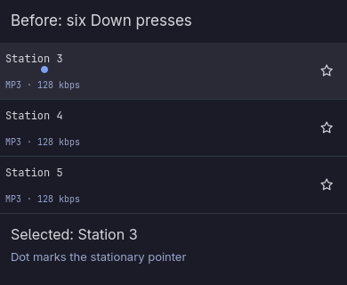
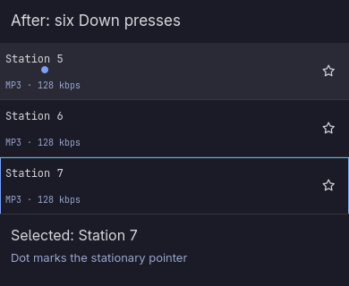

# Keyboard selection with a stationary pointer

Park the pointer over the first station, then press Down six times. On main at `70197e9`, scrolling a new row under the pointer resets selection: Station 3 ends up selected. With this fix, Station 7 stays selected and retains its keyboard outline.

| Before | After |
| --- | --- |
|  |  |

These captures use the production station list, delegates, selection functions, and Omarchy controls in a real Qt Quick test window. Station names are fixtures. The header, footer, and pointer dot are test annotations; the footer reads the actual selection. Both runs use the same pointer position and key sequence.

Run the regression checks with:

```sh
node tests/pointer-selection.test.mjs
```

They also check pointer movement, leaving and reentering at the same position, click playback and focus, and hovering the favorite button.
