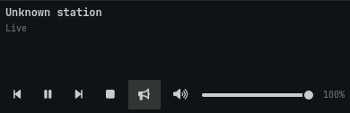
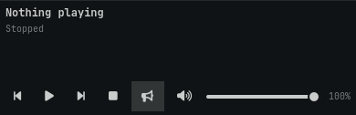
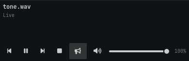

# Stopped playback

An external MPRIS Stop leaves mpv running and unpaused, with no loaded stream.
Main `70197e9` reported only `running: true` and `paused: false`, so the panel
still showed "Live" and a pause button. The bar also remained active.

The status now reports `stopped: true` for idle playback. The panel shows
"Nothing playing", "Stopped", and a play button; the bar shows "Radio stopped"
and is inactive. Play resumes the existing player.

These screenshots render the production player panel in Qt 6.11.2 with the
real Omarchy shell controls and default dark palette, at its normal 390 px
width. They are cropped component renders using actual status payloads from
private mpv, PipeWire, WirePlumber, and D-Bus sessions with a generated tone.
They are not captures of the full application window. Process, filesystem,
and compositor IO are stubbed for the Qt render; desktop devices and settings
were not changed.

| Playback | Main `70197e9` | Fixed |
| --- | --- | --- |
| External Stop |  |  |
| Live |  |  |

The live screenshots are byte-identical. [Recorded status payloads](status-evidence.json)
include live, external Stop, and resumed playback for both versions.

The real Qt regression checks Live/Pause, Paused/Play, Stopped/Play, stream
failure/Retry, bar activation and tooltip text, and clicking Play after Stop.
All 13 player layout and status cases passed. Main fails only the external
Stop case in the same Qt test. The isolated real audio test
also verifies Stop followed by MPRIS Play, PlayPause, and the UI toggle.

```bash
node tests/player-layout.test.mjs
python3 tests/audio-output.test.py --require-dependencies --scenario media-controls
```
